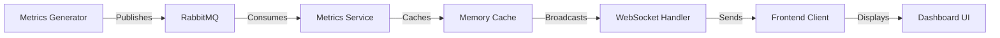

# Real-Time System Monitoring Dashboard

A modern real-time system monitoring dashboard that displays system metrics using WebSocket communication, message queuing, and reactive data visualization.

## Architecture Overview

### Backend Components

```
Backend/DashboardAPI/
├── Services/
│   ├── MetricsService.cs       # Metrics caching and management
│   ├── RabbitMQService.cs      # Message broker integration
│   ├── WebSocketHandler.cs     # WebSocket communication
│   └── MetricsGenerator.cs     # Simulated metrics generation
├── Program.cs                  # Application configuration and DI setup
└── Types/
    └── SystemMetrics.cs        # Data models
```

### Frontend Components

```
Frontend/dashboard/
├── src/
│   ├── components/
│   │   ├── Dashboard.tsx       # Main dashboard component
│   │   └── Dashboard.css       # Styling
│   ├── types/
│   │   └── SystemMetrics.ts    # TypeScript interfaces
│   ├── App.tsx                # Root component
│   └── App.css                # Global styles
```

## Technical Implementation

### 1. Real-time Messaging (WebSockets)
- **Implementation**: Native WebSocket implementation in ASP.NET Core
- **Features**:
  - Bi-directional communication
  - Connection state management
  - Automatic reconnection handling
  - Keep-alive interval (120 seconds)
  - Concurrent connection handling using ConcurrentDictionary

### 2. Message Queue Integration (RabbitMQ)
- **Implementation**: RabbitMQ for reliable message delivery
- **Features**:
  - Publisher/Subscriber pattern
  - Message persistence
  - Fault tolerance with connection recovery
  - Configurable queue settings
  - Error handling and logging

### 3. Data Caching Strategy
- **Implementation**: In-memory caching using ConcurrentQueue
- **Features**:
  - Thread-safe operations
  - Fixed-size cache (100 items)
  - FIFO (First-In-First-Out) strategy
  - Efficient memory usage
  - Fast data access

### 4. Data Visualization
- **Implementation**: Chart.js with React integration
- **Features**:
  - Real-time data updates
  - Responsive design
  - Custom styling and theming
  - Performance optimizations
  - Multiple chart types support

### 5. Clean Architecture
- **Backend**:
  - Dependency Injection
  - Interface-based design
  - Service-oriented architecture
  - Clear separation of concerns
  - Modular components

- **Frontend**:
  - Component-based architecture
  - TypeScript for type safety
  - CSS modules for style isolation
  - React hooks for state management
  - Responsive design patterns

## Performance Optimizations

1. **WebSocket Optimizations**:
   - Binary message format
   - Connection pooling
   - Keep-alive mechanism
   - Efficient message serialization

2. **Data Management**:
   - Fixed-size data cache
   - Efficient data structures
   - Memory usage optimization
   - Garbage collection consideration

3. **UI Performance**:
   - Throttled updates
   - Efficient re-rendering
   - CSS performance optimization
   - Asset optimization

## Code Quality Measures

1. **Clean Code Principles**:
   - SOLID principles
   - DRY (Don't Repeat Yourself)
   - Single Responsibility
   - Interface Segregation

2. **Error Handling**:
   - Comprehensive error logging
   - Graceful degradation
   - User feedback
   - Recovery mechanisms

3. **Type Safety**:
   - TypeScript usage
   - C# strong typing
   - Interface contracts
   - Null safety

## Real-Time Data Flow



## Security Considerations

1. **WebSocket Security**:
   - Secure WebSocket (wss://)
   - Connection validation
   - Rate limiting
   - Input validation

2. **Data Security**:
   - Data sanitization
   - CORS policy
   - Error message security
   - Secure configuration

## Getting Started

1. **Prerequisites**:
   - .NET 6.0 or later
   - Node.js 14 or later
   - RabbitMQ server

2. **Backend Setup**:
   ```bash
   cd Backend/DashboardAPI
   dotnet restore
   dotnet run
   ```

3. **Frontend Setup**:
   ```bash
   cd Frontend/dashboard
   npm install
   npm start
   ```

## Configuration

- Backend port: 5153
- WebSocket endpoint: ws://localhost:5153/ws
- RabbitMQ default configuration:
  - Host: localhost
  - Queue: metrics_queue
  - Durable: false

## Future Enhancements

1. **Scalability**:
   - Horizontal scaling
   - Load balancing
   - Clustering support

2. **Features**:
   - Historical data
   - Alert system
   - Custom metrics
   - User authentication

3. **Monitoring**:
   - Health checks
   - Performance metrics
   - Usage analytics
   - Error tracking

## Detailed Setup Guide

### 1. System Requirements
- Windows 10 or later / macOS / Linux
- .NET 6.0 SDK or later
- Node.js 14.x or later
- npm 6.x or later
- RabbitMQ Server 3.9 or later
- Git

### 2. RabbitMQ Setup
1. Download and install RabbitMQ Server from the official website:
   ```
   https://www.rabbitmq.com/download.html
   ```

2. Enable RabbitMQ Management Plugin:
   ```bash
   rabbitmq-plugins enable rabbitmq_management
   ```

3. Start RabbitMQ Service:
   - Windows:
     ```bash
     net start RabbitMQ
     ```
   - macOS/Linux:
     ```bash
     sudo systemctl start rabbitmq-server
     ```

4. Verify RabbitMQ is running:
   - Open http://localhost:15672
   - Login with default credentials:
     - Username: guest
     - Password: guest

### 3. Project Setup

1. Clone the repository:
   ```bash
   git clone <repository-url>
   cd technicaltest
   ```

2. Backend Setup:
   ```bash
   # Navigate to backend directory
   cd Backend/DashboardAPI

   # Restore dependencies
   dotnet restore

   # Build the project
   dotnet build

   # Run the backend service
   dotnet run
   ```
   The backend service will start on http://localhost:5153

3. Frontend Setup:
   ```bash
   # Open a new terminal
   # Navigate to frontend directory
   cd Frontend/dashboard

   # Install dependencies
   npm install

   # Start the development server
   npm start
   ```
   The frontend application will start on http://localhost:3000

### 4. Verify Installation

1. Check Backend Status:
   - Open http://localhost:5153/swagger in your browser
   - You should see the Swagger UI documentation

2. Check Frontend Status:
   - Open http://localhost:3000 in your browser
   - You should see the dashboard interface

3. Verify WebSocket Connection:
   - Open browser developer tools (F12)
   - Check the console for WebSocket connection status
   - You should see "Connected to WebSocket" message

4. Verify RabbitMQ Integration:
   - Open http://localhost:15672 in your browser
   - Go to Queues tab
   - You should see "metrics_queue" listed

### 5. Troubleshooting

1. RabbitMQ Connection Issues:
   ```bash
   # Check RabbitMQ service status
   rabbitmqctl status

   # Restart RabbitMQ if needed
   net stop RabbitMQ && net start RabbitMQ  # Windows
   sudo systemctl restart rabbitmq-server    # Linux/macOS
   ```

2. Backend Issues:
   ```bash
   # Clear build files
   dotnet clean

   # Restore and rebuild
   dotnet restore
   dotnet build

   # Run with detailed logging
   dotnet run --verbosity detailed
   ```

3. Frontend Issues:
   ```bash
   # Clear npm cache
   npm cache clean --force

   # Delete node_modules and reinstall
   rm -rf node_modules
   npm install

   # Start with debugging
   npm start -- --verbose
   ```

4. Common Issues:
   - Port 5153 already in use:
     ```bash
     # Find and kill process using port 5153
     netstat -ano | findstr :5153    # Windows
     lsof -i :5153                   # Linux/macOS
     ```
   - WebSocket connection failed:
     - Check if backend is running
     - Verify CORS settings in Program.cs
     - Check browser console for errors

### 6. Development Workflow

1. Running in Development Mode:
   ```bash
   # Terminal 1 - Backend
   cd Backend/DashboardAPI
   dotnet watch run

   # Terminal 2 - Frontend
   cd Frontend/dashboard
   npm start
   ```

2. Accessing Development Tools:
   - Swagger UI: http://localhost:5153/swagger
   - RabbitMQ Management: http://localhost:15672
   - React Dev Tools in browser

3. Making Changes:
   - Backend changes: Auto-reload with `dotnet watch run`
   - Frontend changes: Auto-reload with npm start
   - RabbitMQ config: Restart service to apply changes 